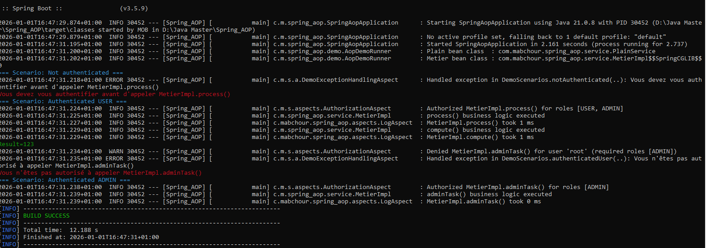

<div align="center">


# 🔄 Spring AOP Demo — Logging & Security with Annotations

<p>


</p>

<p><i>A comprehensive demonstration of Aspect-Oriented Programming with Spring, showcasing cross-cutting concerns management through dynamic proxies</i></p>
</div>

---

## 📖 Table of Contents

- [Overview](#-overview)
- [Architecture](#️-architecture)
- [Project Structure](#-project-structure)
- [AOP Implementation Details](#-aop-implementation-details)
- [Configuration](#️-configuration)
- [Getting Started](#-getting-started)
- [Demo Scenarios](#-demo-scenarios)
- [Extension Ideas](#-extension-ideas)
- [License](#-license)

---

## 🎯 Overview


*Demo output showing the proxy class name (`$$SpringCGLIB$$...`), business method execution, and access denial when the user lacks required roles.*

This application demonstrates how **Spring AOP (Aspect-Oriented Programming)** complements Object-Oriented Programming and Spring IoC to manage **cross-cutting concerns** such as logging and security through **dynamic proxies** (JDK/CGLIB), without modifying business logic.

### ✨ Key Features

- 📝 **Declarative logging** using a custom `@Log` annotation
- 🔒 **Method-level authorization** using a custom `@SecuredByAspect` annotation
- 🎭 **Dynamic proxy generation** via Spring AOP (CGLIB)
- 🛡️ **Integration with Spring Security** for role-based access control

---

## 🏗️ Architecture

This Spring Boot console application routes business method calls through Spring-generated proxies. Aspects intercept these calls to execute technical logic before and after method execution.

### 🔄 Execution Flow

1. Application context initializes via `main()`
2. `IMetier` bean is retrieved from the Spring container
3. Spring returns a **proxy instance** (typically `$$SpringCGLIB$$...`)
4. Configured aspects execute around annotated methods

---

## 📁 Project Structure

### `com.mabchour.spring_aop`
- **`SpringAopApplication`**: Main entry point that executes demo scenarios and displays proxy class information

### `com.mabchour.spring_aop.service`
- **`IMetier`**: Business interface defining methods `process()`, `compute()`, and `adminTask()`
- **`MetierImpl`**: Business implementation annotated with `@Log` and `@SecuredByAspect`
- **`PlainService`**: Service bean without AOP for comparison purposes

### `com.mabchour.spring_aop.aspects`
- **`@Log`**: Custom annotation to enable method-level logging
- **`LogAspect`**: Logging aspect using `@Around` for execution timing and `@AfterThrowing` for exception tracking
- **`@SecuredByAspect`**: Custom security annotation with configurable `roles` attribute
- **`AuthorizationAspect`**: Security aspect using `@Around` to validate required roles

### 🛡️ Security Integration
The demo leverages Spring Security's **SecurityContext** (`SecurityContextHolder`) with programmatically defined `GrantedAuthority` instances (e.g., `ROLE_USER`, `ROLE_ADMIN`) for demonstration purposes.

---

## 🔍 AOP Implementation Details

### 🎭 Dynamic Proxy Generation

The application uses CGLIB proxies, as evidenced by the proxy class name:
```
com.mabchour.spring_aop.service.MetierImpl$$SpringCGLIB$$0
```

This confirms that Spring returns a proxy that intercepts method calls before delegating to the business implementation.

### 📝 Logging Aspect (`@Log`)

Methods annotated with `@Log` are intercepted via an `@annotation(...)` pointcut. The aspect:
- Measures method execution time
- Logs method entry and exit
- Captures and logs exceptions

### 🔒 Security Aspect (`@SecuredByAspect`)

The authorization aspect reads the `roles` attribute from `@SecuredByAspect` and:
- Permits execution if the current user possesses at least one required role (mapped to `ROLE_*` authorities)
- Throws a `RuntimeException` if authorization fails

> **Note**: In production environments, this should be integrated with a real authentication system (database, LDAP, OAuth2). This demo simulates user context for demonstration purposes.

---

## ⚙️ Configuration

The following configuration in `application.properties` enforces CGLIB proxy generation:
```properties
spring.aop.proxy-target-class=true
```

`@EnableAspectJAutoProxy` is used to enable aspect auto-proxying (included for educational clarity, though Spring Boot's AOP starter typically handles this automatically).

---

## 🚀 Getting Started

### Prerequisites
- Java 21 or higher
- Maven 3.6+ (or use included Maven wrapper)

### Running the Application

**Using Maven wrapper (Linux/macOS):**
```bash
./mvnw spring-boot:run
```

**Windows:**
```cmd
.\mvnw.cmd spring-boot:run
```

**Running tests:**
```bash
./mvnw test
```

---

## 🎬 Demo Scenarios

The application executes several scenarios via `CommandLineRunner` that simulate a `USER` role performing various operations:

1. **`metier.process()`** — ✅ Authorized for `USER` and `ADMIN` roles
2. **`metier.compute()`** — 📊 Logged execution without security restrictions
3. **`metier.adminTask()`** — ❌ Denied for `USER`, ✅ authorized for `ADMIN`

Authorization failures are displayed in red using ANSI escape codes for console output clarity.

---

## 💡 Extension Ideas

This demo provides a foundation for exploring additional AOP patterns:

- 🔐 **Production Security Integration**: Replace programmatic security context with Spring Security authentication and map `@SecuredByAspect` to real user authorities
- ⚠️ **Exception Translation**: Implement a dedicated `@AfterThrowing` aspect to standardize exception handling across the application
- 🎯 **Custom Annotations**: Create additional cross-cutting concerns such as:
  - `@Cacheable` for result caching
  - `@Encrypted` for data encryption/decryption
  - `@Monitored` for performance metrics
  - `@Audited` for audit logging
- 💾 **Transaction Management**: Demonstrate declarative transaction boundaries using `@Transactional`

---


<div align="center">
<p>Made with ❤️ using Spring Framework</p>
<p>
<a href="#-spring-aop-demo--logging--security-with-annotations">Back to top ⬆️</a>
</p>
</div>